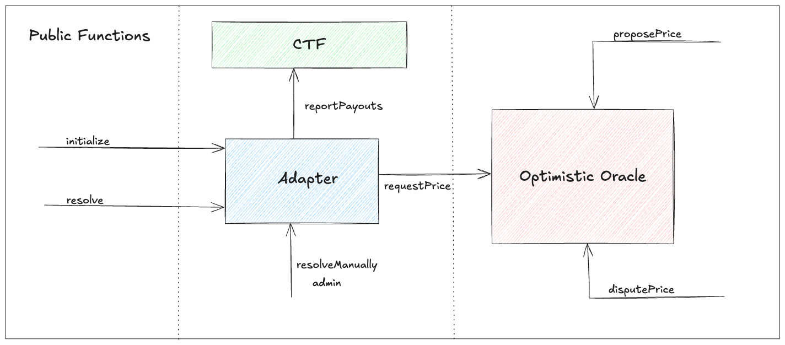

### Architecture

### High Level Contract Architecture

### Question Resolution Flowchart

The Adapter is an [oracle](https://github.com/gnosis/conditional-tokens-contracts/blob/master/contracts/ConditionalTokens.sol#L65) to [Conditional Token FPMMs](https://docs.gnosis.io/conditionaltokens/), which Polymarket prediction markets are based on. It fetches resolution data from UMA's Optmistic Oracle and resolves the FPMM based on said resolution data. 

When a new market is deployed, it is `initialized` on the Adapter, meaning question data such as resolution time, description, etc are stored onchain on the adapter.

After initialization, anyone can call `requestResolutionData` which queries the Optimistic Oracle for resolution data using the previously stored question data. Note: callers will need to approve `rewardToken` with the Adapter as spender as question initializers can specify a `rewardToken` and `reward` amount to incentivize UMA proposers to respond accurately

UMA Proposers will then respond to the request and fetch resolution data offchain. If the resolution data is not disputed, the data will be available to the Adapter after a defined liveness period(currently about 2 hours). If the proposal is disputed, UMA's [DVM](https://docs.umaproject.org/getting-started/oracle#umas-data-verification-mechanism) is the fallback and will return data after a 48 - 72 hour period.

After resolution data is available, anyone can call `reportPayouts` which resolves the market.
